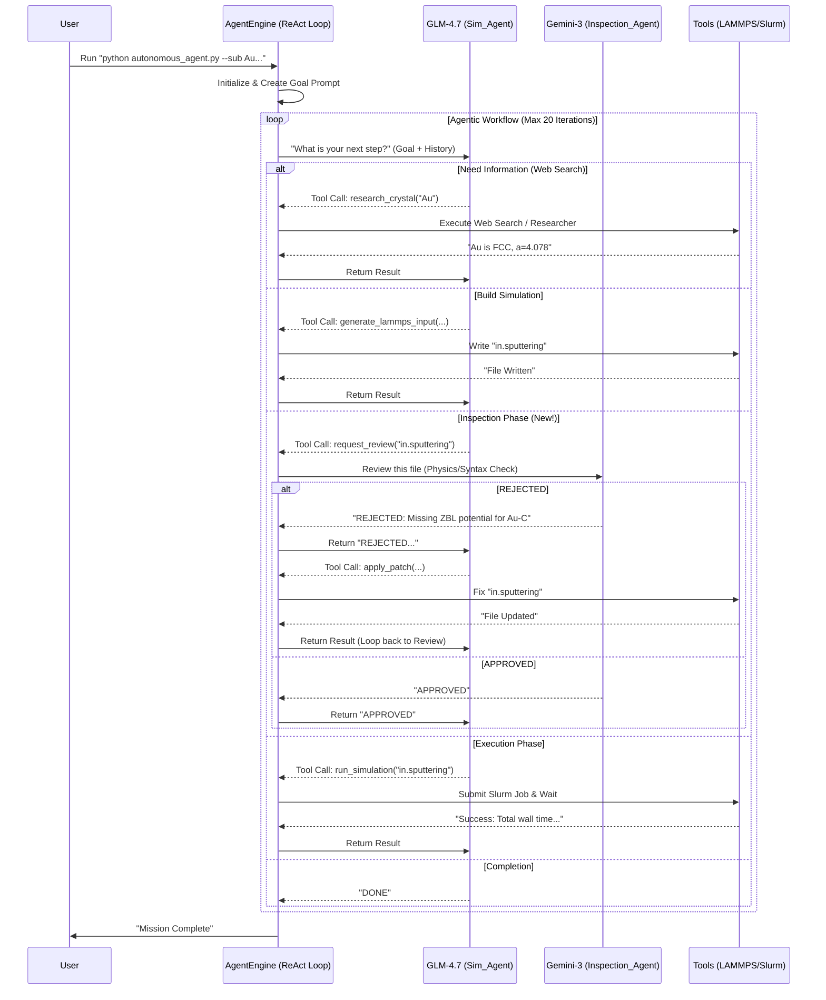

# System Architecture: Multi-Agent MD Simulation

This diagram illustrates how the `Sim_Agent` (Executor) and `Inspection_Agent` (Reviewer) collaborate to run a defect-free simulation.

```mermaid
sequenceDiagram
    participant User
    participant AgentCore as AgentEngine (ReAct Loop)
    participant SimAgent as GLM-4.7 (Sim_Agent)
    participant Inspector as Gemini-3 (Inspection_Agent)
    participant Tool as Tools (LAMMPS/Slurm)

    User->>AgentCore: Run "python autonomous_agent.py --sub Au..."
    AgentCore->>AgentCore: Initialize & Create Goal Prompt
    
    loop Agentic Workflow (Max 20 Iterations)
        AgentCore->>SimAgent: "What is your next step?" (Goal + History)
        
        alt Need Information (Web Search)
            SimAgent-->>AgentCore: Tool Call: research_crystal("Au")
            AgentCore->>Tool: Execute Web Search / Researcher
            Tool-->>AgentCore: "Au is FCC, a=4.078"
            AgentCore->>SimAgent: Return Result
            
        else Build Simulation
            SimAgent-->>AgentCore: Tool Call: generate_lammps_input(...)
            AgentCore->>Tool: Write "in.sputtering"
            Tool-->>AgentCore: "File Written"
            AgentCore->>SimAgent: Return Result
            
        else Inspection Phase (New!)
            SimAgent-->>AgentCore: Tool Call: request_review("in.sputtering")
            AgentCore->>Inspector: Review this file (Physics/Syntax Check)
            
            alt REJECTED
                Inspector-->>AgentCore: "REJECTED: Missing ZBL potential for Au-C"
                AgentCore->>SimAgent: Return "REJECTED..."
                SimAgent-->>AgentCore: Tool Call: apply_patch(...)
                AgentCore->>Tool: Fix "in.sputtering"
                Tool-->>AgentCore: "File Updated"
                AgentCore->>SimAgent: Return Result (Loop back to Review)
            else APPROVED
                Inspector-->>AgentCore: "APPROVED"
                AgentCore->>SimAgent: Return "APPROVED"
            end
            
        else Execution Phase
            SimAgent-->>AgentCore: Tool Call: run_simulation("in.sputtering")
            AgentCore->>Tool: Submit Slurm Job & Wait
            Tool-->>AgentCore: "Success: Total wall time..."
            AgentCore->>SimAgent: Return Result
            
        else Completion
            SimAgent-->>AgentCore: "DONE"
        end
    end
    
    AgentCore->>User: "Mission Complete"
```
